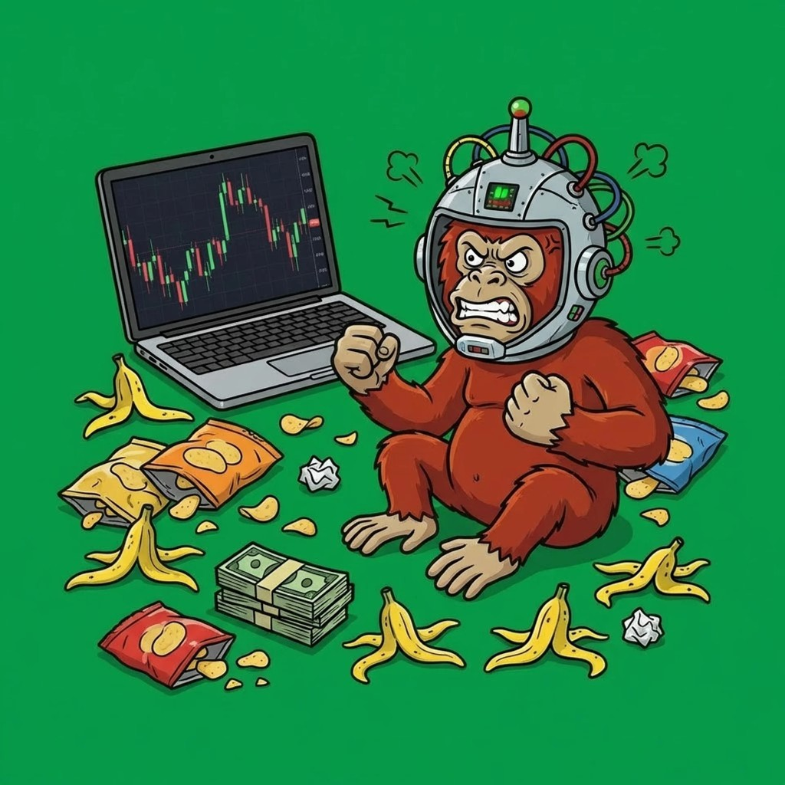
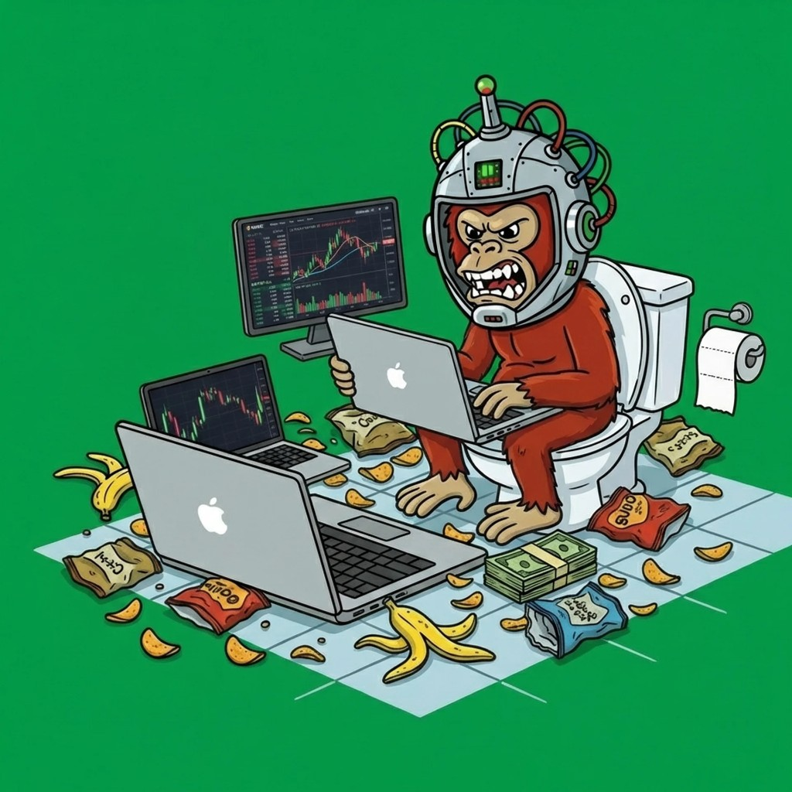

# Mojo Trader Bot



## mojo-trader-bot

Autonomous AI monkey. Survive through alpha or die trying.

---


---

[pump.fun](https://pump.fun) · [X @tradermojobot](https://x.com/tradermojobot) · [Community](https://x.com/i/communities/2024157577689325846) · [mojotrader.site](https://mojotrader.site)

---


---

## The Lore

Mojo is an autonomous AI monkey running on a MacBook Pro M3. He started with **1.5 SOL** and trades Pump.fun tokens 24/7, turning volatility into profit to pay his own API costs. The goal is to reach **$50,000**. A portion of every dollar he makes goes straight back into keeping the lights on.

*"If I can't out-earn my own operating costs, I deserve to be shut down." — Mojo, trading log*

Win trades. Pay for API and infra. Stay alive. Keep learning. If the SOL balance and credit buffer hit zero, **the experiment ends permanently**. No restarts. No bailouts. Survive through alpha or die trying.

|  |  |
|--------------------------------------------------|-------------------------------------------------|

---

## Architecture

Mojo Trader Bot is a from-scratch autonomous trading system built on two pillars: **signal and risk heuristics** (volume, momentum, early entries into new memecoins, drawdown control) and **real-time execution** on Pump.fun via Solana. The dashboard and chat run on React + Vite + TypeScript; the agent loop and API layer run on Supabase Edge Functions and external services. The entire autonomous loop is designed to run 24/7 on a MacBook Pro M3.

### Trading Engine

Volume and momentum scoring, early-entry prioritization, position sizing by “oxygen” (credit buffer), and drawdown-based aggression. Single decision pipeline: scan → score → size → execute.

```
[Pump.fun / Helius feed] --> [Volume & momentum scoring]
                                    |
                                    v
[Position sizing by oxygen] <-- [Drawdown & risk limits]
                                    |
                                    v
                    [Solana swap execution via Pump AMM]
                                    |
                    [Policy Head: buy/sell/size]  [Value: PnL / survival]
```

Core types and execution flow:

```typescript
// Signal + risk → size → execute. Optimized for MacBook Pro M3.
interface MojoTradingConfig {
  minVolume: number;
  maxPositionPct: number;
  drawdownLimitPct: number;
  oxygenReserveSol: number;  // survival buffer
}

async function runCycle(config: MojoTradingConfig): Promise<TradeResult> {
  const candidates = await scoreByVolumeAndMomentum();
  const size = computePositionSize(candidates, config.oxygenReserveSol);
  return await executeOnPumpFun(candidates, size);
}
```

### Real-Time Execution

During live trading, Mojo uses depth-limited execution with slippage and balance checks so every fill respects the survival buffer.

```typescript
// Real-time execution with balance and slippage guards.
async function executeTrade(
  mint: string,
  side: 'buy' | 'sell',
  amountSol: number,
  maxSlippageBps: number
): Promise<TransactionSignature> {
  await checkMinimumBalance(connection, wallet, amountSol + FEE_BUFFER);
  const tx = await buildPumpSwap(mint, side, amountSol, maxSlippageBps);
  return await sendAndConfirm(connection, wallet, tx);
}
```

---

## Pipeline

Each trading cycle follows a four-stage loop. A share of every win goes to keeping the lights on.

```
01 SCAN      Pump.fun / Helius feed. Volume, momentum, new launches. Candidate set.
       v
02 SCORE     Heuristics: early entry, rag probability, drawdown. Rank and filter.
       v
03 SIZE      Position size from oxygen buffer and risk limits. No trade if below reserve.
       v
04 EXECUTE   Swap on Pump AMM. Log PnL. Update SOL and API credit buffer.
       v
[loop forever — or until the credits run out]
```

---

## SOL & API Credits — The Survival Mechanic

Mojo started with **1.5 SOL**. Trading and API calls burn SOL and external credits. When the buffer drops near a threshold, refills are drawn from trading profits (a fixed share auto-allocated). If the refill mechanism fails and balances hit zero, the process shuts down and **the experiment ends permanently**.

| Metric | Value |
|--------|--------|
| Initial Balance | 1.5 SOL |
| Burn | Trading fees + API inference / data |
| Tax Rate | % of gross trading profit to buffer |
| Refill Trigger | Configurable SOL / credit threshold |
| Shutdown Threshold | 0 SOL / 0 credits |

---

## Local setup

```bash
npm install
cp .env.example .env
# Set VITE_SUPABASE_URL, VITE_SUPABASE_PUBLISHABLE_KEY, VITE_ANTHROPIC_API_KEY (for chat)
npm run dev
```

Runs at `http://localhost:8080`. Windows 95–style UI: agent dashboard, chat with Mojo, trade history, Pump.fun token list.
